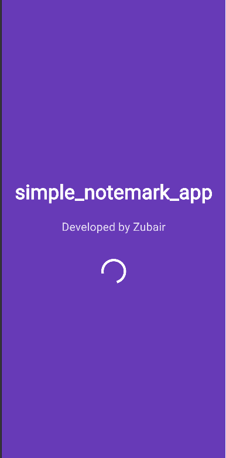
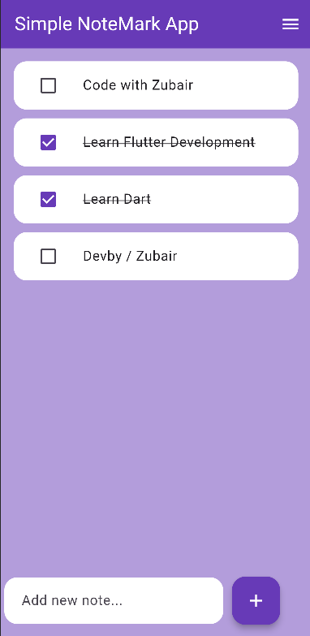
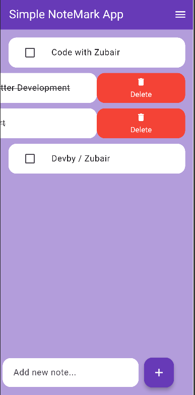
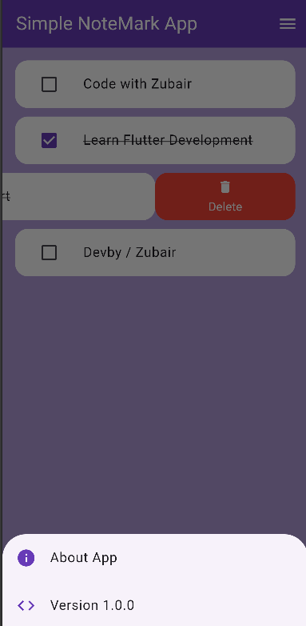
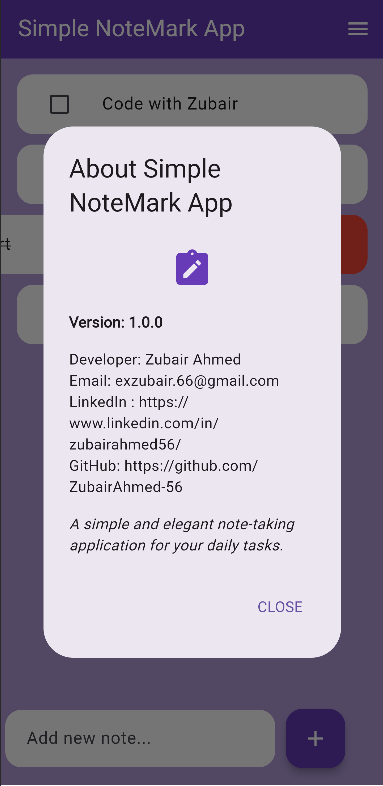

# **📝 Simple NoteMark App**

✨ A minimal and elegant note-taking application built with Flutter, designed for quick task management with a beautiful purple theme.

## **🌟 Features**
- 🖊️ Add, edit, and delete notes
- ✅ Mark tasks as complete/incomplete
- 🎨 Clean purple-themed UI
- ℹ️ About section with developer info
- 🔖 Version information display
- 🚀 Splash screen with loading animation

## **🛠 Tech Stack**
- **Flutter** - Beautiful native apps
- **Dart** - Client-optimized language
- **Material Design** - Modern UI components
- **VS Code** - Lightweight editor

If you like this project, give it a ⭐ on GitHub and connect with me
- GitHub : https://github.com/ZubairAhmed-56
- LinkedIn : https://www.linkedin.com/in/zubairahmed56/

## **📸 Screenshots**

<p align="center">
  
  
  
  
  
</p>

## **⚡ Quick Start**
### Prerequisites
- Flutter SDK (>=3.7.0)
- Android Studio or VS Code

### Installation
```bash
# 1. Clone the repository
git clone https://github.com/ZubairAhmed-56/simple_notemark_app.git

# 2. Install dependencies
flutter pub get

# 3. Run the app
flutter run
